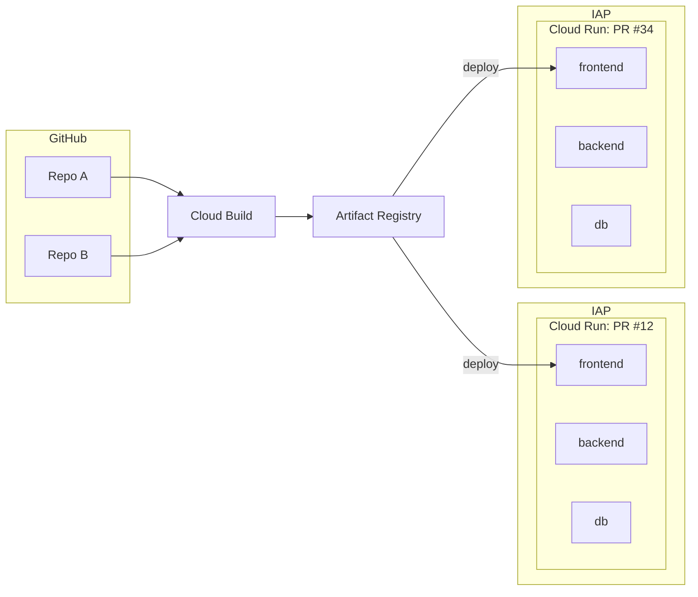

# prenv

Per-PR preview environments on Google Cloud: deploy on a label, tear down when the PR closes.
A Google Cloud version of the preview environment setup in
[this blog post](https://www.m3tech.blog/entry/2026/06/16/153849).

## Architecture



## Structure

```
.
├── backend/, frontend/, db/    sample app deployed by this repo's own preview environment
├── terraform/
│   ├── base/                  one-time foundation (applied once, locally, by the project owner)
│   ├── modules/preview/       reusable Cloud Run preview module — other repos call this
│   └── env/preview/           this repo's own calling example
└── .github/workflows/
    ├── reusable-{deploy,destroy,gc}-prenv.yml   reusable workflows (workflow_call)
    └── deploy-prenv.yml, teardown-prenv.yml, gc-prenv.yml      thin triggers that call the above
```

## Onboarding another repository

Prerequisites, from the project owner:

- the six values `GCP_PROJECT_ID`, `WIF_PROVIDER`, `DEPLOY_SA`, `BUILD_SA`, `AR_REPO`, `GCS_BUCKET`
- your repo added to base's `github_repositories`

Run the `setup-prenv` skill (`.claude/skills/setup-prenv`) in your repo. It automates:

- creating the `preview` GitHub environment and setting the six values above
- creating the `preview` label
- writing `deploy-prenv.yml` / `teardown-prenv.yml` / `gc-prenv.yml` trigger workflows that call this repo's reusable workflows
- writing a `terraform/env/preview` stub that calls `terraform/modules/preview`

See `docs/DESIGN.md` for how the module and reusable workflows are referenced.

## Usage

- Add the `preview` label to a PR → a preview URL is commented on the PR.
- Close the PR (or run the teardown workflow manually) → the environment is destroyed.
- Idle 3+ days → swept by the daily GC.

## More

- [docs/DESIGN.md](docs/DESIGN.md) — design decisions and rationale.
- [CONTRIBUTING.md](CONTRIBUTING.md) — dev environment setup and how to submit changes.
